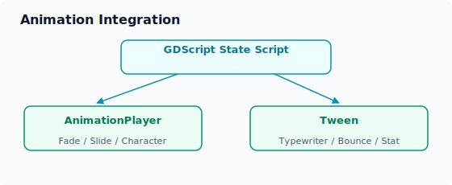

# 动画与特效

ERA-Engine 基于 Godot 引擎，可以利用 Godot 强大的动画系统为游戏添加丰富的视觉表现。本章介绍如何在 ERA-Engine 的 FSM 架构中集成 `AnimationPlayer` 和 `Tween`。

## Godot 动画系统概览

Godot 提供了两种主要的动画方式：

| 方式 | 特点 | 适用场景 |
|:-----|:-----|:---------|
| **AnimationPlayer** | 基于关键帧，时间轴驱动 | 复杂序列动画、角色动画、UI 过渡 |
| **Tween** | 代码驱动，插值动画 | 简单的属性动画、动态效果 |



## 使用 AnimationPlayer

### 在场景中创建动画

1. 在 Godot 编辑器中，为 View 场景添加 `AnimationPlayer` 节点
2. 创建新的动画资源，设置关键帧
3. 在状态脚本中通过代码控制播放

```gdscript
# my_scene.gd
extends ERAState

func on_enter():
    # 获取 AnimationPlayer 节点
    var anim = get_node("/root/Prototype/AnimationPlayer")

    # 播放淡入动画
    anim.play("fade_in")

    # 等待动画完成后显示文本
    await anim.animation_finished
    TXT("场景加载完成。")
    BTN("继续", "next_scene")
```

### 常用动画模板

| 动画名称 | 说明 | 典型持续时间 |
|:---------|:-----|:------------|
| `fade_in` | 界面淡入 | 0.5s |
| `fade_out` | 界面淡出 | 0.5s |
| `slide_in` | 面板滑入 | 0.3s |
| `text_typewriter` | 文字逐字显示 | 可变 |
| `character_enter` | 角色立绘进入 | 0.8s |
| `character_leave` | 角色立绘退出 | 0.6s |

### 结合 FSM 的状态转换动画

在状态退出时播放过渡动画：

```gdscript
# 退出当前状态时
func on_exit():
    var anim = get_node("/root/Prototype/AnimationPlayer")
    anim.play("fade_out")
    await anim.animation_finished

# 在 ViewService 中监听状态切换
func OnButtonPressed(button: Button, state: String):
    button.Disabled = true
    # 可以先播放点击动画再发射信号
    var tween = CreateTween()
    tween.TweenProperty(button, "modulate:a", 0.5, 0.1)
    await tween.Finished
    EmitSignal(SignalName.ButtonExecuted, state)
```

## 使用 Tween

### Tween 基础用法

Godot 4 使用基于场景树的 Tween 系统：

```gdscript
# 创建 Tween
var tween = create_tween()

# 链式调用：动画属性
tween.tween_property(node, "position", Vector2(100, 200), 0.5)
tween.tween_property(node, "modulate", Color.RED, 0.3)
tween.tween_callback(func(): print("动画完成"))
```

### 文字特效

```gdscript
# 文字逐字显示效果
func typewriter_effect(label: Label, full_text: String, speed: float = 0.05):
    label.text = ""
    label.visible_characters = 0

    var tween = create_tween()
    tween.tween_property(
        label, "visible_characters",
        full_text.length(), speed * full_text.length()
    )

    # 播放打字音效（如果有）
    # AudioManager.play_sfx("typewriter")
```

### 按钮交互动效

```gdscript
# 按钮弹性点击效果
func animate_button_press(button: Button):
    var tween = create_tween()
    # 缩小
    tween.tween_property(button, "scale", Vector2(0.95, 0.95), 0.05)
    # 弹回
    tween.tween_property(button, "scale", Vector2(1.0, 1.0), 0.1)
        .set_ease(Tween.EASE_OUT).set_trans(Tween.TRANS_ELASTIC)
```

### 数值变化动画

```gdscript
# 体力值平滑变化显示
func animate_stat_change(display_label: Label, stat_name: String,
                          old_value: int, new_value: int):
    var tween = create_tween()
    var current = old_value

    tween.tween_method(
        func(v: int):
            display_label.text = "%s: %d" % [stat_name, v],
        old_value, new_value, 0.5
    )
```

### 角色表现

- 角色立绘的入场/退场动画
- 表情切换时的淡入淡出
- 对话时立绘的微动效（呼吸效果）

### UI 反馈

- 按钮 hover/press 状态切换动画
- 选项出现的依次弹出效果
- 状态栏数值变化的平滑过渡

## 架构集成指南

### ViewService 中的动画支持

可以在 `ViewService` 中添加动画辅助方法：

```csharp
// ViewService.cs 扩展
public void PlayViewAnimation(string animationName)
{
    var animPlayer = GetNode<AnimationPlayer>("AnimationPlayer");
    if (animPlayer != null && animPlayer.HasAnimation(animationName))
    {
        animPlayer.Play(animationName);
    }
}

public async Task PlayViewAnimationAsync(string animationName)
{
    var animPlayer = GetNode<AnimationPlayer>("AnimationPlayer");
    animPlayer.Play(animationName);
    await ToSignal(animPlayer, "animation_finished");
}
```

### 信号驱动的动画触发

利用 Godot 信号系统实现状态驱动的动画：

```csharp
// Controller.cs 中添加动画信号连接
ViewService.TextCommanded += async (text) =>
{
    await ViewService.PlayViewAnimationAsync("text_appear");
};
```

```gdscript
# 在 GDScript 状态中触发动画
func on_enter():
    var view_service = GameManager.Instance.Controller.ViewService
    view_service.PlayViewAnimation("scene_transition_in")
    # 动画完成后显示内容...
```

## 性能注意事项

- **同时运行的 Tween 数量**：避免同一时间运行过多并行动画（建议不超过 10 个）
- **复杂场景的帧率**：在大量动画播放时监控 FPS，必要时简化动画
- **复用 vs 创建**：尽量复用 `AnimationPlayer` 中的预定义动画，减少运行时代码创建的 Tween
- **移动端优化**：在移动平台上考虑减少粒子效果和复杂 shader 动画
\ No newline at end of file