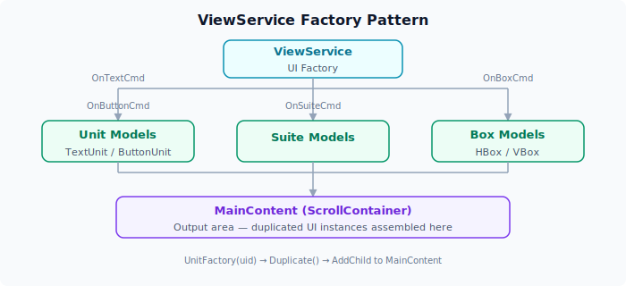

# 自定义 UI 组件

ERA-Engine 的视图系统基于工厂模式构建，允许开发者通过扩展 `ViewService` 来创建自定义的 UI 组件类型。本章将详细介绍其工作原理和扩展方法。

## 设计原理

### 工厂模式概述

`ViewService` 使用工厂方法模式来创建不同类型的 UI 单元（Unit）。每个 Unit 类型由一个 `UnitContainer` 子类表示，工厂方法负责从模板中复制（Duplicate）对应的 Godot 节点。



### 核心类关系

```csharp
// UnitContainer 是所有 Unit 的基类
[GlobalClass]
public partial class UnitContainer : PanelContainer
{
    [Export] public Control Element { get; set; }
}

// 具体 Unit 类型通过继承定义
[GlobalClass]
public partial class ButtonUnit : UnitContainer { }

// ViewService 中的工厂方法
private Node UnitFactory(string uid)
{
    var unit = UnitModels.FindChild(uid).Duplicate();
    CurrentUnit = unit;
    return unit;
}
```

### ViewModels 枚举

引擎预定义了以下视图模型类型（`ViewModels` 枚举）：

| 枚举值 | 说明 | 用途 |
|:------|:-----|:-----|
| `Unit` | 基础单元分类节点 | 存放所有 Unit 模板 |
| `TextUnit` | 文本单元 | 显示纯文本内容 |
| `ButtonUnit` | 按钮单元 | 可点击的交互按钮 |
| `Box` | 容器单元分类节点 | 存放所有 Box 模板 |
| `HBox` | 水平容器 | 水平排列子元素 |
| `VBox` | 垂直容器 | 垂直排列子元素 |
| `Suite` | 套件模板 | UI 组件组合 |
| `View` | 视图根节点 | 整体视图模板 |
| `Controls` | 控件集合 | 通用控件模板 |

## 创建自定义 Unit 类型

### 步骤 1：定义 C# 类

创建继承自 `UnitContainer` 的新类：

```csharp
// MyCustomUnit.cs
using EraEngine.Core;
using Godot;

namespace EraEngine.Core
{
    [GlobalClass]
    public partial class MyCustomUnit : UnitContainer
    {
        // 添加自定义属性
        [Export] public string CustomData { get; set; }

        // 添加自定义方法
        public void SetCustomDisplay(string text)
        {
            if (Element is Label label)
            {
                label.Text = $"[自定义] {text}";
            }
        }
    }
}
```

!!! note "注册为 GlobalClass"
    使用 `[GlobalClass]` 特性注册新类，使其在 Godot 编辑器中可用，并允许 GDScript 引用。

### 步骤 2：创建 Godot 场景模板

1. 在 Godot 编辑器中创建新的 `PanelContainer` 场景
2. 将根节点的脚本设置为 `MyCustomUnit.cs`
3. 添加子控件（如 Label、TextureRect 等）作为 `Element`
4. 保存到 `UnitModels` 对应的模板目录中


### 步骤 3：扩展 ViewService 工厂

在 `ViewService` 中添加工厂方法和命令处理：

```csharp
// ViewService.cs 中添加
public void OnCustomCommanded(string text, string data)
{
    var unit = (MyCustomUnit)UnitFactory("MyCustomUnit");
    unit.Name = "Custom-" + MainContent.GetChildCount();
    unit.SetCustomDisplay(text);
    unit.CustomData = data;

    Utils.AddAndOwnChild(MainContent, unit);
}
```

### 步骤 4：注册信号连接

在 `Controller._Ready()` 中添加信号绑定：

```csharp
// Controller.cs
FlowService.CustomCommanded += ViewService.OnCustomCommanded;
```

并在 `FlowService` 中定义信号：

```csharp
// FlowService.cs
[Signal]
public delegate void CustomCommandedEventHandler(string text, string data);
```

## 完整的 Unit 创建流程

以 `ButtonUnit` 为例，一个完整的创建流程如下：

1. `FlowService` 发出信号：`EmitSignal(SignalName.ButtonCommanded, text, state)`
2. `ViewService` 接收信号：`OnButtonCommanded(string text, string state)`
3. 工厂方法创建节点：`UnitFactory(nameof(ViewModels.ButtonUnit))` → `UnitModels.FindChild("ButtonUnit").Duplicate()`
4. 配置节点属性：设置文本、绑定 `Pressed` 事件
5. 添加到场景树：`Utils.AddAndOwnChild(MainContent, unit)`

## 最佳实践

### 遵循命名约定

- **C# 类名**：使用 `XxxUnit` 格式（如 `ProgressBarUnit`、`ImageUnit`）
- **Godot 场景名**：与类名保持一致
- **ViewModels 枚举**：添加对应的枚举值，保持命名一致性

### 使用 Element 属性

`UnitContainer.Element` 属性指向子控件树的根节点。在自定义 Unit 中：

```csharp
public override void _Ready()
{
    base._Ready();
    // Element 已在基类中自动赋值为第一个子节点
    if (Element is MyCustomControl control)
    {
        control.Setup(CustomData);
    }
}
```

### 处理内存和生命周期

- 工厂方法使用 `Duplicate()` 而非实例化，模板不会进入场景树
- 使用 `Utils.AddAndOwnChild()` 确保正确的所有权关系
- 在适当时机调用 `QueueFree()` 清理不再需要的 Unit

### 保持与信号系统联动

确保新的 Unit 类型能通过信号与 `FlowService` 通信：

```csharp
// 在 Unit 内部触发信号传递到 FlowService
button.Pressed += () =>
{
    EmitSignal(SignalName.CustomAction, customPayload);
};
```
\ No newline at end of file