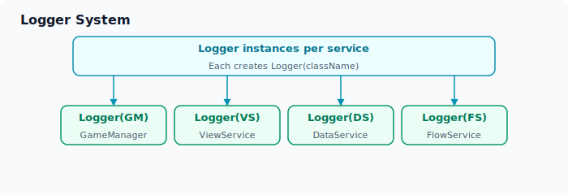
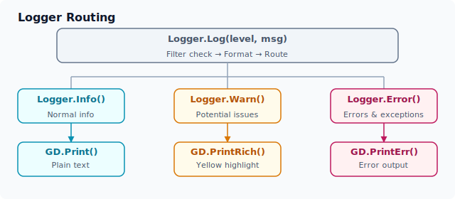
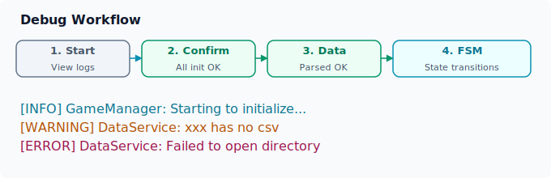

# 调试与日志

ERA-Engine 内置了 `Logger` 日志系统，为开发和调试提供了结构化的日志输出。本章介绍 Logger 的架构、使用方法和调试模式。

## Logger 架构

### 设计概览

`Logger` 是一个分部类（`partial class`），每个服务类创建自己的 Logger 实例并传入类名。日志输出通过 Godot 的 `GD.Print` 系列方法实现。



### 核心实现

`Logger` 内部的三级路由机制，将不同的日志级别分发到对应的 Godot 输出方法：



| 调用方法 | 用途 | 输出方式 | 颜色 |
|:--------|:----|:--------|:----|
| `Logger.Info(msg)` | 正常的流程信息、状态变更 | `GD.Print` | 白色 |
| `Logger.Warn(msg)` | 潜在问题、降级处理 | `GD.PrintRich` | **黄色** |
| `Logger.Error(msg)` | 错误、异常、失败操作 | `GD.PrintErr` | **红色** |
| `Logger.Error(msg, ex)` | 带异常堆栈的错误 | `GD.PrintErr` | **红色** |

`Logger` 是一个分部类（`partial class`），每个服务类创建自己的 Logger 实例并传入类名。构造时传入的 `className` 会被嵌入每条日志，配合 `[CallerLineNumber]` 特性自动捕获调用行号，方便定位问题来源。

### 日志格式

每条日志的输出格式：

```
[级别] 类名:line 行号 - 消息内容
```

示例输出：

```
[INFO] GameManager:line 36 - Starting to initialize GameManager...
[INFO] Controller:line 20 - Initializing Controller...
[WARNING] DataService:line 119 - character_bob has no csv
[ERROR] DataService:line 49 - Failed to open directory: 'res://Data/' not found or inaccessible.
```

## 日志级别

### LogCategory 枚举

```csharp
public enum LogCategory
{
    Information,  // 一般信息
    Warning,      // 警告
    Error,        // 错误
}
```

### 各级别使用指南

| 级别 | 方法 | 用途 | 输出方式 | 控制台颜色 |
|:-----|:-----|:-----|:---------|:----------|
| Information | `Logger.Info(msg)` | 正常的流程信息、状态变更 | `GD.Print` | 白色 |
| Warning | `Logger.Warn(msg)` | 潜在问题、降级处理 | `GD.PrintRich` | **黄色** |
| Error | `Logger.Error(msg)` | 错误、异常、失败操作 | `GD.PrintErr` | **红色** |
| Error (with Exception) | `Logger.Error(msg, ex)` | 带异常堆栈的错误 | `GD.PrintErr` | **红色** |

### 各服务中的典型日志示例

```csharp
// GameManager - 初始化生命周期
Logger.Info($"Starting to initialize {GetType().Name}...");
Logger.Info($"Starting to initialize {nameof(Core.Controller)}.");
Logger.Info($"{GetType().Name} initialized.");

// DataService - 数据处理
Logger.Info($"Opening data directory: {DataDirectory}");
Logger.Info($"Retrieved file paths: {paths}");
Logger.Warn($"{filename} has no csv");
Logger.Error($"Failed to open directory: '{DataDirectory}' not found or inaccessible.", exception);

// ViewService - 视图操作
Logger.Info($"Initializing `{GetType().Name}`...");

// Controller - 信号连接
Logger.Info($"{GetType().Name}: services assigned.");
Logger.Info($"{GetType().Name}: signals assigned.");
```

## 使用 Logger

### 创建 Logger 实例

```csharp
// 在每个类中创建静态或实例 Logger
public partial class MyService : Node
{
    private static Logger Logger { get; } = new(nameof(MyService));
    // 或 private Logger Logger = new(nameof(MyService));
}
```

### 基础用法

```csharp
// 信息日志
Logger.Info("操作成功完成。");

// 警告日志
Logger.Warn("配置文件缺失，使用默认值。");

// 错误日志
Logger.Error("连接失败！");

// 带异常的错误日志
try
{
    DoSomething();
}
catch (Exception ex)
{
    Logger.Error("操作执行失败。", ex);
}
```

### 自动行号追踪

Logger 使用 `[CallerLineNumber]` 特性自动捕获调用位置：

```csharp
// 调用 Logger.Info("测试消息") 的输出：
// [INFO] MyService:line 42 - 测试消息
```

无需手动传递行号，编译时自动注入。

## 调试模式

### DEBUG 预处理指令

源代码中多处使用 `#if DEBUG` 进行调试模式控制：

```csharp
// DataService.cs
#if DEBUG
    DataDirectory = "res://Prototype/";  // 调试时使用硬编码路径
#endif
```

### 典型的 DEBUG 用法

```csharp
// 仅在调试模式下执行的代码
#if DEBUG
    Logger.Info($"调试信息：当前数据 = {data}");
    ShowDebugOverlay();
#endif

// 调试和发布使用不同配置
#if DEBUG
    var configPath = "res://Dev/Config/";
#else
    var configPath = "res://Config/";
#endif
```

### 日志过滤器

`_filter` 字段可用于在开发时屏蔽特定类的日志：

```csharp
// 只屏蔽 Utils 类的日志
_filter = "Utils";

// 不过滤任何日志（默认）
_filter = "";
```

过滤后的类不会输出任何日志，有助于减少噪声。

## 调试工作流

### 典型的调试流程



### 检查清单

在开发过程中，通过日志确认以下关键点：

- [ ] GameManager 单例正确初始化
- [ ] Controller 全部服务分配完成
- [ ] 信号连接正确建立
- [ ] DataService 找到数据目录并成功加载
- [ ] 拓扑排序正确（无循环依赖）
- [ ] ViewService 导入 View 模板成功
- [ ] FlowService 加载主状态脚本成功

## 调试技巧

### 使用 Godot 内置工具

ERA-Engine 日志与 Godot 工具链无缝集成：

| 工具 | 用途 |
|:-----|:-----|
| **输出面板（Output）** | 查看 `GD.Print` / `GD.PrintErr` 输出 |
| **调试器（Debugger）** | 断点调试、变量监视、堆栈跟踪 |
| **远程调试（Remote Debug）** | 在编辑器中调试运行中的游戏 |
| **性能监视器（Monitor）** | 查看 FPS、内存、节点数等性能指标 |

### 条件日志

```csharp
// 仅在特定条件下输出详细日志
if (isVerboseMode)
{
    Logger.Info($"详细状态：{state}");
}

// 使用 #if DEBUG 包围详细日志
#if DEBUG
    Logger.Info($"节点树结构：{GetTree().Root}");
#endif
```

### 日志搜索技巧

在 Godot 输出面板中按以下模式搜索：

- `WARNING` — 查找所有警告
- `ERROR` — 查找所有错误
- `类名:` — 聚焦特定类的日志
- `line N` — 定位到特定行号

## 下一阶段扩展

以下功能可进一步扩展：

- **日志文件写入**：将日志输出到文件，便于持久化分析
- **日志级别配置**：运行时动态调整日志级别
- **结构化日志**：JSON 格式日志输出，便于工具解析
- **远程日志**：将日志发送到远程服务器用于线上问题诊断
- **性能计数器**：关键路径的耗时日志
\ No newline at end of file