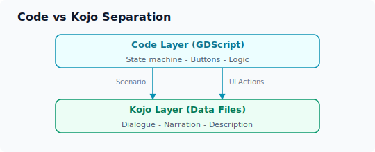
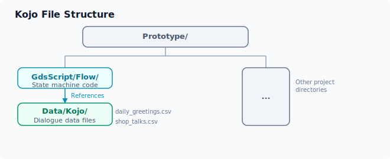

# 口上文件格式

"口上"（Kojo，こうじょう）是 ERA 社区中对话/台词文件的称呼，源自日文「口上書き」。本章介绍 ERA-Engine 中口上文件的格式规范、创建方法以及与代码的分离设计。

## 什么是口上文件？

在 ERA 游戏中，"口上"指的是角色的台词、对话和叙述文本。与游戏逻辑代码不同，口上文件专注于内容创作：



### 为什么分离代码和口上？

| 优势 | 说明 |
|:-----|:-----|
| **创作者友好** | 写作者无需学习编程，直接编辑表格即可 |
| **易于翻译** | 口上文件独立，可单独进行多语言翻译 |
| **模组开发** | 模组作者只需提供新的口上文件即可扩展内容 |
| **版本管理** | 代码和内容分别追踪变更，减少合并冲突 |

## 口上文件格式

### 数据文件格式（推荐）

ERA-Engine 推荐使用 CSV 格式存储口上数据，便于使用电子表格软件编辑：

```csv
id,context,character,condition,tone,text
greeting_morning,卧室_早晨,爱丽丝,好感度>=50,温柔,"早安，今天天气真不错呢。"
greeting_morning,卧室_早晨,爱丽丝,好感度<50,冷淡,"...早。"
greeting_evening,酒馆_傍晚,鲍勃,,热情,"哟，来得正好！今天有新到的货物！"
battle_start,地下城_战斗,通用,,激昂,"战斗开始了！做好准备！"
shop_buy,商店_购买,查理,金钱>=100,商人,"这可是难得的好货，确定要吗？"
```

### 字段说明

| 字段 | 类型 | 说明 | 必填 |
|:-----|:-----|:-----|:----:|
| `id` | string | 口上的唯一标识符，格式建议：`场景_事件` | ✅ |
| `context` | string | 触发场景/状态上下文 | ✅ |
| `character` | string | 说话角色，`通用` 表示无特定角色 | ✅ |
| `condition` | string | 触发条件表达式，为空表示始终触发 | ❌ |
| `tone` | string | 语气标签，用于表情/立绘切换 | ❌ |
| `text` | string | 完整台词文本 | ✅ |

### 条件表达式

`condition` 字段支持简单的逻辑表达式：

```
# 比较运算符
好感度>=50
血量<30
金钱==100

# 逻辑组合
好感度>=30 && 好感度<70
持有物品_钥匙 && 地点==城堡

# 函数调用
has_flag("story_chapter2")
is_night_time()
```

## 口上扩展：语气与表情联动

通过 `tone` 字段，口上可以与角色立绘/表情系统联动：

```csv
id,context,character,condition,tone,text
talk_daily,日常对话,爱丽丝,,开心,"今天在花园里发现了一朵很漂亮的花！"
talk_daily,日常对话,爱丽丝,好感度<30,冷漠,"没什么特别的事。"
talk_daily,日常对话,爱丽丝,好感度>80,害羞,"那个...我有话想跟你说..."
```

对应的表情切换逻辑：

```gdscript
# 在显示台词时自动切换表情
func display_kojo(entry: Dictionary):
    TXT(entry.text)
    if entry.tone:
        character_manager.set_expression(entry.character, entry.tone)
```

## 创建口上文件的流程

### 1. 确定场景和事件列表

先列出所有需要口上的场景：

| 场景 | 事件 ID | 需要口上的角色 |
|:-----|:--------|:--------------|
| 卧室早晨 | `greeting_morning` | 爱丽丝 |
| 酒馆傍晚 | `greeting_evening` | 鲍勃、查理 |
| 战斗开始 | `battle_start` | 通用 |
| 商店购买 | `shop_buy` | 查理 |

### 2. 创建 CSV 口上文件



### 3. 编写编辑器辅助工具（可选）

为提升口上编写效率，可以开发简单的辅助工具：

- VS Code 扩展：CSV 语法高亮和口上字段校验
- Google Sheets 模板：可视化编辑口上表
- 口上测试工具：在游戏中快速预览特定台词

## 口上文件的编码规范

### 命名规范

```
{模块}_{场景}_{角色}.csv
daily_living_alice.csv
battle_general.csv
shop_merchant_charlie.csv
```

### 文本规范

- 使用 UTF-8 编码
- 对话文本中的特殊字符（逗号、引号）需转义或用引号包裹
- 台词中的变量用 `{variable}` 标记，运行时替换

```csv
id,text
greeting_time,"现在时间是{time}，{character_name}向你问好。"
```

### 版本管理

口上文件的变更追踪：

```csv
id,version,author,date,text
greeting_morning,1.1,Alice,2025-06-01,"早安。"
greeting_morning,1.2,Bob,2025-06-15,"早上好！今天天气真不错呢。"
```

## 与传统 ERA 口上的对比

| 特性 | 传统 ERA（Emuera） | ERA-Engine |
|:-----|:-------------------|:-----------|
| 存储格式 | ERB 脚本内嵌 | CSV 独立文件 |
| 编辑方式 | 文本编辑器 | 电子表格 / 文本编辑器 |
| 条件系统 | ERB 代码中的 IF 语句 | CSV 中的 condition 表达式 |
| 多语言 | 需复制整个脚本 | 独立的翻译 CSV |
| 模组支持 | 覆盖原始脚本 | 追加 CSV 文件 |
\ No newline at end of file