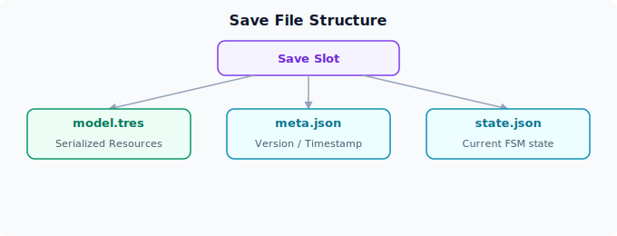

# 存档与读档

存档与读档功能通过 `ModelService` 和 Godot 的 `Resource` 系统实现序列化与反序列化。本章介绍其设计原理和使用方法。

## 架构设计

### 核心思路

ERA-Engine 的存档系统基于以下设计原则：

- **所有游戏数据都是 Godot Resource**：角色属性、物品、标志位等全部以 `Resource` 形式存储
- **UID 作为唯一标识**：每个 Resource 通过 `uid()` 方法返回唯一标识符
- **树形组织**：数据以树形结构组织在 `Model` 节点下，通过 `DataModel` 分类管理
- **继承链验证**：保存时自动验证 Resource 是否继承自 `Data` 基类


### ModelService.Save() 方法

`ModelService` 中的 `Save` 方法是数据持久化的核心入口：

```csharp
// ModelService.cs - 简化版
public Resource Save(Resource resource)
{
    // 1. 验证 Resource 不为 null
    ArgumentNullException.ThrowIfNull(resource);

    // 2. 验证脚本有效
    var gdScript = (GDScript)resource.GetScript();
    var globalName = gdScript.GetGlobalName();

    // 3. 遍历继承链，获取所有基类的 class_name
    var baseNames = new Array<string> { globalName };
    while (gdScript != null && !globalName.Equals(Constants.DataBaseName))
    {
        gdScript = (GDScript)gdScript.GetBaseScript();
        if (gdScript != null)
            baseNames.Add(gdScript.GetGlobalName());
    }

    // 4. 验证是否继承自 Data 基类
    // 5. 通过 uid() 方法获取唯一标识
    if (resource.HasMethod(DataFunctionName.Uid))
    {
        var uid = resource.Call(DataFunctionName.Uid).ToString();
        model.Resources.Add(uid, resource);
    }

    return resource;
}
```

## 数据序列化

### Resource 格式

Godot 的 `Resource` 类原生支持序列化。一个典型的角色数据 Resource：

```gdscript
# character_alice.gd
extends CharacterData  # 继承自 Data 基类
class_name CharacterAlice

@export var name: String = "爱丽丝"
@export var stamina: int = 100
@export var affection: int = 50
@export var location: String = "酒馆"

func uid() -> String:
    return "character.alice"
```

### 数据文件驱动

游戏数据通常从 CSV 文件加载，由 `DataService` 在初始化时处理：

```csv
uid,name,stamina,affection,location
character.alice,爱丽丝,100,50,酒馆
character.bob,鲍勃,80,30,广场
character.charlie,查理,60,70,公会
```

`DataService._Init()` 的工作流程：

1. 扫描工作目录下的数据文件夹
2. 按扩展名分类文件（`.gd` 脚本和 `.csv` 数据源）
3. 验证数据脚本继承自 `Data` 基类
4. 对脚本进行基于依赖的拓扑排序
5. 按顺序加载 CSV，逐行实例化 Resource 并调用 `ModelService.Save()`


## 存档功能实现



### 存档内容范围

一次完整的存档包含：

### 存档与读档的 API

```cpp
// 预期 API（具体实现待定）
// 存档
GameManager.Instance.Save(string slotName);
// 读档
GameManager.Instance.Load(string slotName);
// 删除存档
GameManager.Instance.DeleteSave(string slotName);
// 列出存档
GameManager.Instance.ListSaves();
```

## 数据查询与检索

### 按 UID 查找

```csharp
// 通过 globalName 和 uid 精确查找
var alice = Controller.ModelService.Find("Character", "character.alice");
```

### 按路径查找

```csharp
// 通过点号分隔的路径查找
var target = Controller.ModelService.Find("Character.character.alice");
// 等价于 Model.FindChild("Character").FindChild("character.alice")
```

### 在 GDScript 中访问

```gdscript
# 在状态脚本中访问数据
func on_enter():
    var player = GameManager.Instance.Controller.ModelService.Find("Character", "character.player")
    TXT("当前体力: " + str(player.stamina))
```

## 序列化模式与注意事项

### 序列化友好设计

编写数据模型时遵循以下原则以确保可序列化：

```gdscript
class_name MyData
extends Data

# ✅ 好的做法：使用 @export 标记可序列化字段
@export var value: int = 0
@export var label: String = ""

# ❌ 避免：动态属性不会被自动序列化
func _ready():
    self.runtime_value = 42  # 存档时不会保存
```

### 循环引用处理

避免在数据模型之间创建循环引用：

```gdscript
# ❌ 避免：循环引用
@export var parent: Node  # 如果 parent 也引用了当前节点

# ✅ 替代方案：使用 UID 引用
@export var parent_uid: String = ""
```

### 版本兼容

当数据模型版本更新时，在 `_csv()` 方法中处理兼容性：

```gdscript
func _csv(data: Dictionary) -> void:
    name = data.get("name", "")
    stamina = int(data.get("stamina", "0"))
    # 向后兼容：如果旧版 CSV 没有新字段，使用默认值
    new_field = int(data.get("new_field", "0"))
```
\ No newline at end of file