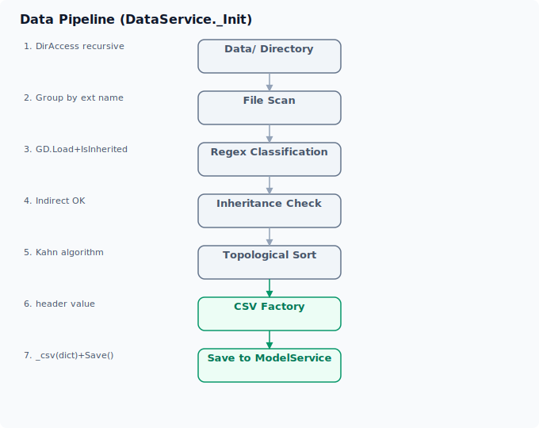

# 架构总览

ERA-Engine 采用 **MVC（Model-View-Controller）** 三层架构，由 C# 实现引擎核心，GDScript 负责数据定义和流程脚本。

## 架构图

## 三层职责

### Controller 层

引擎的命令中心，聚合四大服务并建立信号连接。

| 服务 | 职能 | 关键方法 |
|------|------|---------|
| **ModelService** | 数据模型存储与查询 | `Save()`, `Find()`, `Get()` |
| **ViewService** | UI 工厂，动态生成界面单元 | `_Init()`, `OnTextCommanded()`, `OnButtonCommanded()`, `OnBoxCommanded()` |
| **DataService** | 数据管道：扫描→分类→验证→排序→加载 | `_Init(workDirectory)` |
| **FlowService** | FSM 状态机，流程控制 | `CallMainState()`, `CommandText()`, `CommandButton()`, `CommandBox()` |

### Model 层

数据的容器和定义。

- **Model.cs** — 顶层容器，持有 `DataModel`（运行时数据节点）和 `ViewModel`（UI 模板节点）
- **DataModel.cs** — 每个数据类别（如 Character / Item）对应一个 DataModel 节点，内部存储 `Dictionary<String, Resource>` 资源字典
- **ViewModel 组件** — ButtonUnit、UnitContainer、MainContent 等 UI 元素类
- **GDScript Data 基类** — `data.gd` 定义 `_csv()`、`_uid()`、`set_uuid()` 等虚拟方法，业务数据类继承它

### View 层

UI 的运行时表现。`View.cs` 是基础 Control 节点，ViewService 在其上通过工厂模式动态复制 UI 模板生成界面。

## 数据流全景

## C# 与 GDScript 互操作模式

| 方向 | 机制 | 示例 |
|------|------|------|
| GDScript → C# | `GameManager.Controller` 访问 | `flow_service.CommandText(text)` |
| C# → GDScript | `Object.Call()` 动态调用 | `MainState.Call("main_state")` |
| C# → C# | Godot 信号 | `FlowService.TextCommanded += ViewService.OnTextCommanded` |
| C# → GDScript 数据 | `GDScript.New()` + `.Call("_csv", dict)` | 运行时实例化数据对象 |

## 目录结构

