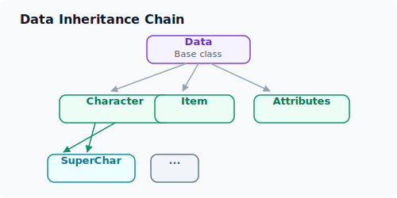
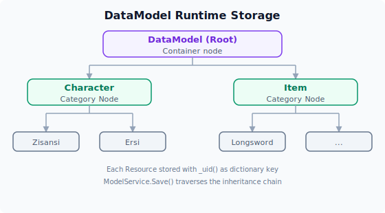

# 数据系统

DataService 是整个引擎的**数据管道**，负责将 `Data/` 目录下的 GDScript 数据定义文件（`.gd`）和数据源文件（如 `.csv`）转化为运行时可查询的 C# Resource 对象，存储到 ModelService 中。

## 管道全貌

1. 构造数据目录路径：`DataDirectory = WorkDirectory + "Data/"`
2. 目录扫描：`Utils.GetFilePaths()` 递归遍历
3. 文件分类：`GroupPathsByRegex` 按扩展名→文件名分组
4. 脚本实例化 + 继承验证：`GD.Load<GDScript>(path)` + `Utils.IsInherited()`
5. 拓扑排序：`SortScriptsByDependency()` 按依赖排序
6. CSV 工厂：header→value 映射 → `model.Call("_csv", dict)`
7. 持久存储：`ModelService.Save(resource)` → DataModel 运行时内存

## 步骤详解

### 1. 目录扫描与文件分类

`Utils.GetFilePaths()` 使用 Godot 的 `DirAccess` API 递归遍历 Data 目录。随后通过正则表达式按扩展名和文件名分组，每个数据类名对应一个 `.gd` 文件和一个或多个 `.csv` 文件。

> `data.gd`（Data 基类）必须唯一存在，否则抛出异常。

### 2. 脚本实例化与继承验证

对每个 `.gd` 文件：加载 → `GD.Load<GDScript>(path)` → 验证继承 `Data`（`Utils.IsInherited(script, "Data")`）。间接继承也有效：



### 3. 拓扑排序

数据模型之间存在引用依赖（如 `Character` 有 `@export var weapon: Item`），必须在被依赖者加载之后再加载依赖者。算法通过反射检查属性 `type == Variant.Type.Object`，使用 Kahn 算法保证加载顺序。循环依赖会抛出异常。

### 4. CSV 工厂（核心）

按拓扑排序后的顺序，对每个模型类遍历其 CSV 数据文件，每一行生成一个数据对象实例：

```csharp
// 对每个 CSV 数据行
var godotObject = (Resource)modelsByClassname[filename].New();

// 构建 header→value 映射字典 (header行为列名，数据行为值)
var dict = new Dictionary<string, string>();
for (int i = 0; i < csvRow.Count; i++)
    dict.Add(csvHeader[i], csvRow[i]);

// 调用 GDScript 的 _csv() 方法填充属性
godotObject.Call("_csv", dict);

// 保存到 ModelService
ModelService.Save(godotObject);
```

对应的 GDScript 数据处理示例：

```gdscript
# character.gd 中的 _csv 方法
func _csv(pair: Dictionary):
    char_name = pair["名字"]
    age = pair["年龄"].to_int()
    background = pair["背景"]
    素质 = tags_to_array(pair["素质"])
    set_weapon(pair["武器"])
```

### 5. 存储

`ModelService.Save()` 遍历资源继承链，按最具体基类名创建 DataModel 节点，用 `_uid()` 返回值作为 key 存入 Resources 字典。

存储结构示例：



## 数据模型 GDScript 规范

### Data 基类 (`data.gd`)

```gdscript
class_name Data extends Resource

func _csv(_row: Dictionary):  # 子类必须重写
    pass

func _uid() -> String:        # 子类重写返回唯一标识
    return ""

func get_object_by_name(global_name, object_name) -> Object:
    return GameManager.Controller.ModelService.Find(global_name, object_name)
```

### 数据类编写规则

1. 继承 `Data`（`extends Data` 或间接继承）
2. 重写 `_csv(pair: Dictionary)` — 从字典取值赋给属性
3. 重写 `_uid() -> String` — 返回唯一标识符
4. 跨模型引用使用 `@export var 引用名: 模型类名`
5. 初始化顺序：`@export 默认值 → _init() → _csv()`，后覆盖前
