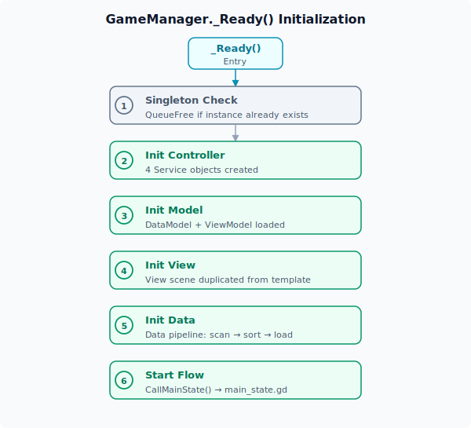

# 启动流程

ERA-Engine 的启动由 `GameManager._Ready()` 驱动。GameManager 作为 Godot **Autoload 单例**，在引擎启动时自动实例化，是所有子系统的初始化入口。

## Autoload 注册

在 `project.godot` 中声明两个 Autoload：

```ini
[autoload]

GameManager="*res://Prototype/CspScript/GameManager.cs"
Global="*res://Prototype/GdsScript/Data/global.gd"
```

- **GameManager** — C# 引擎核心单例，控制整体生命周期
- **Global** — GDScript 全局变量节点，存储游戏运行时状态（天数、金钱、行动点数等）

## 初始化顺序

`GameManager._Ready()` 严格按以下顺序执行，每步都有独立的 `try-catch` 错误处理：



## 逐步详解

### 步骤 1：单例检查

```csharp
if (Instance is null)
{
    Instance = this;
}
else
{
    QueueFree();
    return;
}
```

确保全局只有一个 GameManager 实例。如果已经存在（场景重载等情况），销毁新实例。

### 步骤 2：初始化 Controller

```csharp
Controller ??= Utils.GetOrAddNode<Controller>(this);
```

`Utils.GetOrAddNode<T>(parent)` 先查找已存在的同名子节点，没有则新建并添加到 parent。Controller 的 `_Ready()` 中依次实例化四个 Service 子节点，并建立信号连接：

```csharp
// Controller._Ready() 中的信号绑定
FlowService.TextCommanded += ViewService.OnTextCommanded;
FlowService.ButtonCommanded += ViewService.OnButtonCommanded;
FlowService.BoxCommanded += ViewService.OnBoxCommanded;

ViewService.ButtonExecuted += FlowService.OnButtonExecuted;
```

### 步骤 3：初始化 Model

```csharp
Controller.ModelService._Init(Model);
```

`Model._Ready()` 加载 `ViewModel.tscn` 场景（包含 UI 模板如 Unit、Suite、Box 的预制节点），并确保 DataModel 子节点存在。ModelService 通过 `_Init()` 持有 Model 引用。

### 步骤 4：初始化 View

```csharp
View ??= (Control)Model.ViewModel.FindChild("View").Duplicate();
View.Visible = true;
Utils.AddAndOwnChild(this, View);
Controller.ViewService._Init(View, Controller.ModelService);
```

View 不是加载新场景，而是**从 ViewModel 中查找 "View" 子节点并 Duplicate**。ViewService._Init() 内部绑定工厂所需的模板引用：

- `UnitModels = ModelService.Get("ViewModel").GetNode("Unit")`
- `SuiteModels = ModelService.Get("ViewModel").GetNode("Suite")`
- `BoxModels = ModelService.Get("ViewModel").GetNode("Box")`
- `MainContent = ViewModel.GetNode("Main/MainScroll/MainContent/Suite/SuiteBox")`

### 步骤 5：初始化 Data

```csharp
Controller.DataService._Init(WorkDirectory);
```

完整数据管道见 [数据系统](./data-system.md)。`WorkDirectory` 默认值为 `"res://Prototype/GdsScript/"`，可通过 `Constants` 全局配置修改。

### 步骤 6：启动 Flow

```csharp
Controller.FlowService.CallMainState();
```

加载并执行 `main_state.gd`，进入游戏主循环。见 [流程控制](./flow-system.md)。

## 错误处理策略

每一步初始化都有独立的 `try-catch` 块。任何一步失败都会：

- 调用 `Logger.Error()` 输出错误详情（含异常堆栈）
- 立即 `return`，中止后续初始化

这意味着初始化阶段是**严格有序且快速失败**的 ── 前置步骤失败不会继续执行后续步骤。

## 关键设计决策

1. **有序初始化** — 必须 View 就绪后才能用 Data（因为数据加载后可能更新 UI），必须 Data 加载完才能启动 Flow（流程依赖数据查询）
2. **Duplicate 模式** — View 从 ViewModel 模板复制而非加载新场景，保证模板的单一来源
3. **GetOrAddNode 模式** — 子节点的延迟创建和查找合并为一个操作，避免重复创建
4. **WorkDirectory 通过全局配置管理** — 项目根目录由 `Constants` 定义，统一管理
