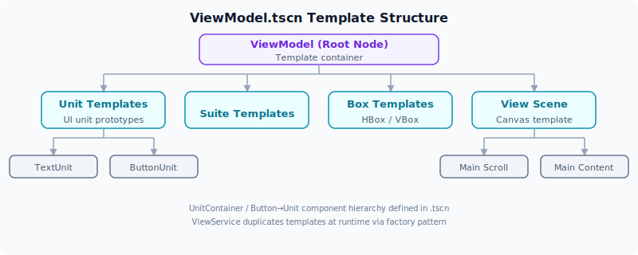

# 视图系统

ViewService 是引擎的 **UI 工厂**，通过从 ViewModel 模板复制预制节点，动态生成游戏界面。它订阅 FlowService 的信号，将文本/按钮/盒子命令转化为实际的 Godot Control 节点并添加到主内容区。

## 工厂模式

ViewService 维护三组模板引用（UnitModels / SuiteModels / BoxModels），在初始化时从 ViewModel 中提取。所有工厂方法采用**查找→复制**模式：

```
模板节点.FindChild(name).Duplicate()
```

复制而非新建，确保预设样式和布局继承自模板。

## UI 模板结构

`ViewModel.tscn` 场景在 Model 初始化时加载，包含以下模板子节点（对应 `ViewModels` 枚举）：



## 信号处理流程

### 文本渲染 (TextCommanded → OnTextCommanded)

FlowService 发射 `TextCommanded(text)` → ViewService 从模板复制 TextUnit，填充文本，添加到 MainContent。

### 按钮渲染 (ButtonCommanded → OnButtonCommanded)

FlowService 发射 `ButtonCommanded(text, state)` → ViewService 复制 ButtonUnit，设置文本，绑定 `Pressed` 事件（发射 `ButtonExecuted(state)`），添加到 MainContent。

### 按钮点击回调 (ButtonExecuted → OnButtonExecuted)

用户点击按钮 → `OnButtonPressed` 禁用按钮，发射 `ButtonExecuted(state)` → FlowService 接收后调用 `MainState.Call(state)` 切换到下一个状态。

### 盒子渲染 (BoxCommanded → OnBoxCommanded)

> ⚠️ `BOX()` 当前**始终使用 HBox 模板**（水平布局）。引擎不会自动选择 VBox，VBox 虽在 `ViewModels` 枚举中定义但尚未对接任何 GDScript 命令。

FlowService 发射 `BoxCommanded([nodes])` → ViewService 复制 HBox 模板，将传入的节点从各自父节点移除并加入 HBox（设置 `ExpandFill` 水平拉伸），HBox 加入 MainContent。

**关键细节**: `BTN()`/`TXT()` 调用时 ViewService 已将单元添加到 MainContent。`BOX()` 的作用是将多个分散的 UI 单元重组为一个水平布局。

## UnitContainer 包装器

所有 UI 单元都包裹在 `UnitContainer`（继承 `PanelContainer`）中：

- `Element` 属性指向第一个子节点（实际内容：Label 或 Button）
- 提供面板/边距样式支持
- `ButtonUnit` 直接继承 `UnitContainer`（空类，利用模板中的预制结构）

## MainContent 和自动滚动

`MainContent` 继承 `ScrollContainer`，监听垂直滚动条变化，自动滚动到底部。确保新输出文本始终可见 — 模拟控制台/对话记录的滚动行为。

## 完整渲染路径

以 `main_state()` 中的以下代码为例：

```gdscript
func main_state():
    TXT("era靛紫档案")
    BOX([
        BTN("开始游戏", "start_game"),
        BTN("读取存档", "load_game")
    ])
```

执行路径：

1. `TXT("era靛紫档案")` → `flow_service.CommandText()` → 发射 `TextCommanded` → `ViewService.OnTextCommanded()` → 复制 TextUnit 模板，填充文本，添加到 MainContent。

2. `BTN("开始游戏", "start_game")` → `flow_service.CommandButton()` → 发射 `ButtonCommanded` → `ViewService.OnButtonCommanded()` → 复制 ButtonUnit 模板，设置文本和点击事件，添加到 MainContent。

3. `BTN("读取存档", "load_game")` → 同上。

4. `BOX([unit1, unit2])` → `flow_service.CommandBox()` → 发射 `BoxCommanded` → `ViewService.OnBoxCommanded()` → 复制 HBox 模板，将两个按钮从 MainContent 移入 HBox，HBox 加入 MainContent。

最终 MainContent 包含：
- `Text-0`（Label "era靛紫档案"）
- `Box-1`（HBox 含两个 Button："开始游戏" / "读取存档"）
