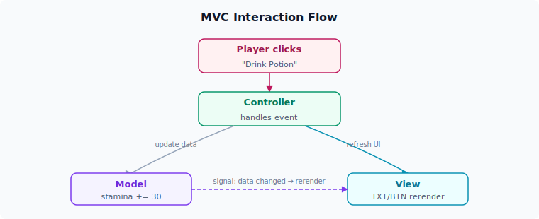
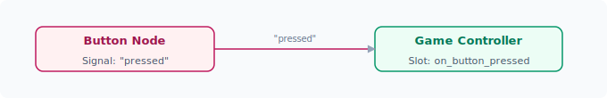

# 核心概念

ERA-Engine 的架构建立在几个关键的设计模式之上。理解这些概念将帮助你更好地使用引擎和编写游戏逻辑。即使你之前没有接触过这些模式，也不必担心——下面会用简单的例子逐一解释。

---

## 有限状态机（FSM — Finite State Machine）

### 什么是有限状态机？

有限状态机是一种编程模型，它将程序的行为划分为多个**状态（State）**，每次只能处于其中一个状态。当特定条件满足时，程序会从一个状态**转换（Transition）**到另一个状态。

> 📖 类比：就像一部选择式冒险小说——你在第 3 页，有两个选择：「打开门」→ 翻到第 7 页，「走开」→ 翻到第 12 页。每一页就是一个「状态」，每个选择就是一次「转换」。

### ERA-Engine 如何运用 FSM？

在 ERA-Engine 中，**游戏的每一个画面都是一个状态**。例如：

- `title_screen` — 标题画面
- `morning_bedroom` — 早晨的卧室场景
- `shop_menu` — 商店菜单
- `talk_to_heroine` — 与女主角对话

每个状态用 GDScript 编写，定义一个类继承自 `ERAState`：

```gdscript
# morning_bedroom.gd
extends ERAState

func on_enter():
    TXT("阳光透过窗帘洒进房间，新的一天开始了。")
    BTN("起床洗漱", "bathroom")
    BTN("再睡五分钟", "sleep_more")
    BTN("查看手机", "check_phone")
```

当玩家点击「起床洗漱」，引擎执行转换 `"bathroom"`，进入浴室场景的状态。

### 状态转换示意


### FSM 在 ERA 游戏中的优势

- **清晰的结构**：每个场景独立成一个文件，逻辑不会混杂在一起
- **易于调试**：随时知道当前处于哪个状态，问题定位方便
- **便于协作**：不同作者可以同时编写不同的状态文件，互不冲突
- **天然支持存档**：只需保存当前状态名和相关数据，即可实现存档读档

---

## 模型-视图-控制器（MVC — Model-View-Controller）

### 什么是 MVC？

MVC 是一种将程序拆分为三个相互独立的部分的架构模式：

- **Model（模型）**：负责管理数据和业务规则。它不关心数据如何显示，也不关心用户如何操作。
- **View（视图）**：负责界面的展示。它只负责将数据呈现给用户，不处理业务逻辑。
- **Controller（控制器）**：负责接收用户输入，协调 Model 和 View 之间的交互。

> 📖 类比：在餐厅里，Model 是厨房（管理食材和数据），View 是餐桌上的菜品呈现（用户看到的样子），Controller 是服务员（接收你的点单，通知厨房，把菜端上来）。

### ERA-Engine 中的 MVC 划分

| 层级       | ERA-Engine 中的职责                                      | 举例                                   |
| ---------- | -------------------------------------------------------- | -------------------------------------- |
| **Model**  | 存放游戏数据：角色属性、物品清单、变量值、标志位等      | `player.stamina = 80`                  |
| **View**   | 负责将内容渲染到屏幕：文字显示、按钮排列、UI 面板布局   | `TXT()`, `BTN()`, `BOX()` 的渲染结果   |
| **Controller** | 处理用户输入和状态转换：接收按钮点击，更新 Model，触发状态切换 | 点击按钮 → 改变数值 → 跳转状态      |

### 一个完整的 MVC 交互流程



通过这种分层，当你想改变 UI 样式时，不需要触及游戏逻辑；当你想修改数值计算公式时，不需要改动界面代码。

---

## 观察者模式与 Godot 信号

### 什么是观察者模式？

观察者模式（Observer Pattern）是一种设计模式：一个对象（Subject）维护一组依赖它的对象（Observers），当自身状态变化时，自动通知所有观察者。

### Godot 的信号系统

Godot 内置了观察者模式的实现——**信号（Signal）**。节点可以定义信号，在事件发生时发出；其他节点可以连接（Connect）这些信号，在信号触发时自动执行对应的处理函数。



### 在 ERA-Engine 中的运用

- **状态切换**：当前状态结束时发出信号，状态机管理器监听到信号后切换到下一个状态
- **UI 事件**：按钮点击、滑动条变化等 UI 事件通过信号传递给 Controller
- **数据变更通知**：Model 中的数值变化时发出信号，View 自动更新显示（例如体力值变化后，状态栏自动刷新）

---

## 关键术语表

以下是你将在 ERA-Engine 文档中频繁遇到的术语：

| 术语         | 英文             | 解释                                                                 |
| ------------ | ---------------- | -------------------------------------------------------------------- |
| **状态**     | State            | 游戏的一个画面或场景。每个状态是一个继承 `ERAState` 的 GDScript 类  |
| **转换**     | Transition       | 从一个状态切换到另一个状态的动作。通常由玩家点击按钮触发            |
| **单元（Unit）** | Unit          | 游戏中的角色实体，包含属性和行为。例如玩家、女主角、NPC             |
| **容器**     | Container        | 持有多个 Unit 的逻辑分组。例如「队伍」、「敌人组」                   |
| **套件（Suite）** | Suite        | 一组可复用的 UI 组件集合。例如对话套件、商店套件、战斗套件          |
| **数据模型** | Data Model       | 游戏数据的结构化表示，通常从结构化数据文件加载                  |
| **口上（Kojo）** | Kojo         | 日文「口上」，指角色的台词、对话内容。在 ERA 社区中，口上也指代对话剧本的编写工作 |

掌握以上核心概念后，你就可以更好地理解 ERA-Engine 的整体架构，开始构建你自己的游戏了！
