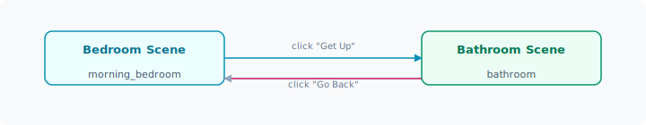

# 添加按钮

文本让游戏有了叙事，而按钮赋予玩家选择的权利。在本教程中，你将学习如何使用 `BTN()` 函数创建交互按钮，并实现不同游戏状态之间的切换。

## 你的第一个按钮

打开 `Prototype/GdsScript/Flow/main_state.gd`，在 `main_state()` 中添加一个 `BTN()` 调用：

```gdscript
func main_state():
    TXT("你站在一个十字路口。")
    TXT("前方有三条路通向不同的方向。")
    BTN("向前走", "go_forward")
```

运行游戏，你会看到文本下方出现一个标签为 **"向前走"** 的按钮。

但是——如果你现在点击这个按钮，什么都不会发生，因为目标状态 `go_forward` 还不存在。

> 💡 `BTN("标签", "目标状态")` 中的第二个参数是一个**状态名**。点击按钮后，ERA-Engine 的 `FlowService` 会查找并调用同名的状态函数来渲染下一个画面。

## 创建目标状态函数

在同一个文件（`main_state.gd`）中，添加一个新的状态函数：

```gdscript
func main_state():
    TXT("你站在一个十字路口。")
    TXT("前方有三条路通向不同的方向。")
    BTN("向前走", "go_forward")

func go_forward():
    TXT("你沿着尘土飞扬的道路向前走去。")
    TXT("远处隐约可见一座城堡的轮廓。")
    BTN("返回", "main_state")
```

现在点击运行，你会看到：

1. **第一个画面**：文字描述 + "向前走"按钮
2. 点击"向前走" → 画面切换到 `go_forward()` 的内容
3. 点击"返回" → 画面回到 `main_state()`

> 🎉 成功实现了状态切换！这是 ERA-Engine 的核心交互模式。

## 状态切换原理

ERA-Engine 使用**有限状态机（FSM）**来管理游戏流程：



当你调用 `BTN("标签", "目标状态")` 时：

1. 引擎在画面上渲染一个可点击的按钮
2. 玩家点击按钮后，`FlowService` 查找名为"目标状态"的函数
3. `FlowService` 调用该函数，渲染新的画面内容与按钮

状态名可以任意命名，只要能找到对应的函数即可。同一个文件中的函数可以互相跳转，不同文件中的状态函数也可以跳转（需要引入文件路径）。

## 创建多个分支

ERB 游戏的精髓在于分支叙事。让我们创建一个更丰富的场景：

```gdscript
extends Node

func main_state():
    TXT("=== 冒险的起点 ===")
    TXT("你站在一个十字路口。前方有三条路通向不同的方向。")
    BTN("走向城堡", "castle_path")
    BTN("进入森林", "forest_path")
    BTN("沿着河流", "river_path")

func castle_path():
    TXT("你向着远处的城堡走去。")
    TXT("城堡的大门敞开着，里面传来欢快的音乐声。")
    BTN("进去看看", "castle_inside")
    BTN("转身离开", "main_state")

func forest_path():
    TXT("你踏入了幽暗的森林。")
    TXT("高大的树木遮天蔽日，四周传来奇怪的声响。")
    BTN("继续深入", "forest_deep")
    BTN("返回路口", "main_state")

func river_path():
    TXT("你沿着清澈的河流漫步。")
    TXT("河面上漂着一只小船，船上似乎有个人影。")
    BTN("呼唤船夫", "river_boat")
    BTN("返回路口", "main_state")

func castle_inside():
    TXT("城堡大厅里正在举行盛大的宴会！")
    TXT("一位身穿礼服的贵族向你举杯致意。")
    BTN("加入宴会", "game_end")
    BTN("悄悄离开", "main_state")

func forest_deep():
    TXT("你在森林深处发现了一个发光的蘑菇圈。")
    TXT("小精灵从蘑菇后面探出头来，好奇地打量着你。")
    BTN("与精灵交谈", "game_end")
    BTN("悄悄后退", "main_state")

func river_boat():
    TXT("你大声呼唤，船夫抬起头来。")
    TXT("\"上来吧，年轻人，我带你去下游的集市。\"")
    BTN("上船", "game_end")
    BTN("道谢离开", "main_state")

func game_end():
    TXT("== 未完待续 ==")
    TXT("感谢体验这个简单的分支叙事演示！")
    BTN("重新开始", "main_state")
```

运行游戏，你就能体验一个拥有多条分支路径的简单冒险故事了。

## 注意事项

- **状态名必须唯一**：如果两个状态函数同名，引擎可能调用错误的状态，导致不可预期的行为
- **循环引用**：避免 `state_a` → `state_b` → `state_a` 无限循环而不给玩家其他选择——好的设计会让玩家始终有"退出"或"返回"的选项
- **文件组织**：随着游戏规模增长，建议将不同场景的状态函数拆分到不同的 `.gd` 文件中，通过文件级函数调用来保持代码整洁

---

现在你已经掌握了文本显示和按钮交互，接下来学习如何使用 [布局容器](layout-boxes.md) 来美化按钮的排列。
