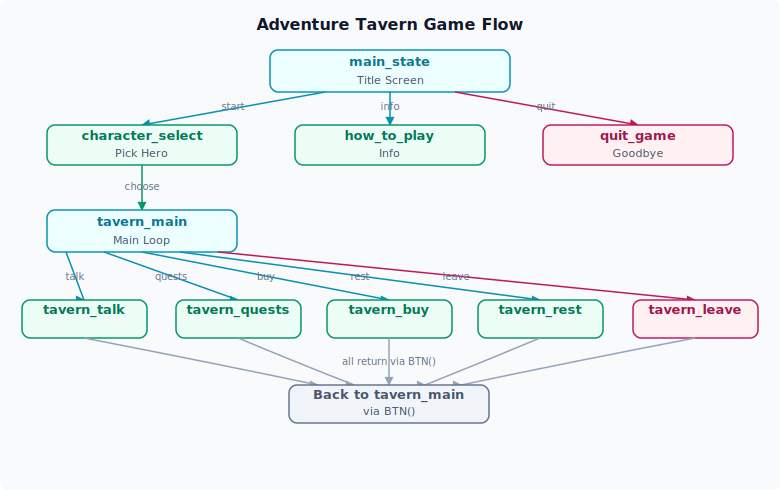

# 完整示例

恭喜你完成了前面所有教程！在本章中，我们将综合运用所有学到的知识——`TXT()`、`BTN()`、`BOX()` 和数据文件——来构建一个完整的迷你游戏。

## 游戏概述

我们将制作一个名为 **"冒险者酒馆"** 的小游戏，包含以下功能：

- **标题画面**：显示游戏名称和开始菜单
- **角色选择**：从 CSV 数据中读取角色，让玩家选择一个角色
- **酒馆主循环**：角色进入酒馆后，可以进行多种互动
- **状态显示**：实时显示角色的 HP 和 MP

## 第一步：准备数据文件

在 `Prototype/Data/` 目录下创建 `Character.csv`：

```csv
id,name,hp,max_hp,mp,max_mp,description
warrior,战士亚瑟,100,100,20,20,身披重甲的王国前骑士，沉默寡言但可靠
mage,法师艾琳,60,60,100,100,年轻的元素法师，对知识充满渴望
ranger,游侠莉娜,80,80,50,50,来自北方森林的追踪者，箭无虚发
healer,祭司马库斯,70,70,80,80,温和的治疗者，总能在关键时刻伸出援手
```

在 `Prototype/GdsScript/` 下创建 `character.gd`：

```gdscript
extends "res://Engine/Data.gd"

# Character 数据模型
# 字段自动从 Character.csv 映射
```

## 第二步：完整游戏代码

创建或修改 `Prototype/GdsScript/Flow/main_state.gd`，替换为以下完整代码：

```gdscript
extends Node

# ============================================================
# 冒险者酒馆 - 完整示例
# 这是一个演示 ERA-Engine 核心功能的迷你游戏
# ============================================================

# ---------- 标题画面 ----------

func main_state():
    # 游戏入口：显示标题和主菜单
    TXT("╔══════════════════════╗")
    TXT("║     🍺 冒险者酒馆 🍺  ║")
    TXT("╚══════════════════════╝")
    TXT("")

    BOX([
        BTN("🎮 开始冒险", "character_select"),
        BTN("📖 游戏说明", "how_to_play"),
        BTN("🚪 离开酒馆", "quit_game"),
    ])

# ---------- 游戏说明 ----------

func how_to_play():
    TXT("=== 📖 游戏说明 ===")
    TXT("")
    TXT("你是一位冒险者，来到了镇上唯一的酒馆。")
    TXT("在这里你可以：")
    TXT("  • 与酒馆中的其他冒险者交谈")
    TXT("  • 接受悬赏任务赚取金币")
    TXT("  • 使用金币购买食物和药水")
    TXT("  • 休息恢复体力")
    TXT("")
    TXT("注意：每次行动都可能影响你的状态！")
    TXT("")
    BTN("返回主菜单", "main_state")

# ---------- 角色选择 ----------

func character_select():
    TXT("=== 选择你的角色 ===")
    TXT("")
    TXT("酒馆老板打量着你：\"新面孔啊，怎么称呼？\"")
    TXT("")

    # 为每个角色创建选择按钮
    # 实际项目中，这些数据从 Character.csv 加载
    BOX([
        BTN("⚔️ 战士亚瑟 (HP:100 MP:20)", "select_warrior"),
        BTN("🔮 法师艾琳 (HP:60 MP:100)", "select_mage"),
    ])
    BOX([
        BTN("🏹 游侠莉娜 (HP:80 MP:50)", "select_ranger"),
        BTN("✨ 祭司马库斯 (HP:70 MP:80)", "select_healer"),
    ])
    BTN("↩️ 返回主菜单", "main_state")

# ---------- 角色选择确认 ----------

func select_warrior():
    TXT("你选择了：⚔️ 战士亚瑟")
    TXT("\"力量即是正义。我会保护好这间酒馆的。\"")
    TXT("")
    show_confirm_start("warrior")

func select_mage():
    TXT("你选择了：🔮 法师艾琳")
    TXT("\"有趣……我感觉到这座酒馆里有某种魔法痕迹。\"")
    TXT("")
    show_confirm_start("mage")

func select_ranger():
    TXT("你选择了：🏹 游侠莉娜")
    TXT("\"这酒馆的鹿肉派不错，我早就盯上了。\"")
    TXT("")
    show_confirm_start("ranger")

func select_healer():
    TXT("你选择了：✨ 祭司马库斯")
    TXT("\"愿圣光庇佑这间酒馆中的每一位旅人。\"")
    TXT("")
    show_confirm_start("healer")

func show_confirm_start(character_id):
    # 通用的确认开始函数
    BOX([
        BTN("✅ 确认进入酒馆", "tavern_main"),
        BTN("↩️ 重新选择", "character_select"),
    ])

# ---------- 酒馆主循环 ----------

func tavern_main():
    TXT("=== 🍺 冒险者酒馆 · 大厅 ===")
    TXT("")
    TXT("你走进酒馆大厅。温暖的炉火、嘈杂的人声和麦酒的香气扑面而来。")
    TXT("角落里坐着几个冒险者，公告板上贴满了悬赏令。")
    TXT("")
    TXT("你要做什么？")
    TXT("")

    # 使用嵌套 BOX 来分组按钮
    BOX([
        BTN("🗣️ 与冒险者交谈", "tavern_talk"),
        BTN("📋 查看悬赏令", "tavern_quests"),
    ])
    BOX([
        BTN("🍗 购买食物 (30金币)", "tavern_buy_food"),
        BTN("🧪 购买药水 (50金币)", "tavern_buy_potion"),
    ])
    BOX([
        BTN("😴 休息恢复", "tavern_rest"),
        BTN("👤 查看状态", "tavern_status"),
    ])
    BTN("🚪 离开酒馆", "tavern_leave")

# ---------- 酒馆子场景 ----------

func tavern_talk():
    TXT("=== 酒馆中的冒险者们 ===")
    TXT("")

    TXT("你走到角落的桌旁，几位冒险者正在喝酒聊天。")
    TXT("")
    TXT("老猎人巴德：\"嘿，新来的！听说过北边洞穴里的宝藏吗？\"")
    TXT("年轻的学徒莉亚：\"别听他的，上次他说的'安全路线'差点让我喂了龙！\"")
    TXT("沉默的佣兵：\"……（默默地擦拭着剑）\"")
    TXT("")
    TXT("你与冒险者们愉快地交谈了一阵，获知了不少情报。")
    TXT("")

    BTN("回到大厅", "tavern_main")

func tavern_quests():
    TXT("=== 📋 悬赏公告板 ===")
    TXT("")

    TXT("公告板上钉着几张泛黄的羊皮纸：")
    TXT("")
    TXT("┌─ 悬赏令 ─────────────────┐")
    TXT("│ 1. 清理下水道的巨型老鼠  │")
    TXT("│    赏金：100金币          │")
    TXT("│    难度：★☆☆☆☆           │")
    TXT("│                          │")
    TXT("│ 2. 调查废弃矿坑的异响    │")
    TXT("│    赏金：300金币          │")
    TXT("│    难度：★★★☆☆           │")
    TXT("│                          │")
    TXT("│ 3. 讨伐北部山区的巨龙    │")
    TXT("│    赏金：10000金币        │")
    TXT("│    难度：★★★★★           │")
    TXT("└──────────────────────────┘")
    TXT("")

    BOX([
        BTN("接受任务：下水道老鼠", "quest_rats"),
        BTN("接受任务：废弃矿坑", "quest_mine"),
        BTN("接受任务：北部巨龙", "quest_dragon"),
    ])
    BTN("回到大厅", "tavern_main")

func quest_rats():
    TXT("你接下了清理下水道老鼠的任务。")
    TXT("（任务系统将在后续版本中完善）")
    TXT("")
    BTN("回到大厅", "tavern_main")

func quest_mine():
    TXT("你接下了调查废弃矿坑的任务。")
    TXT("（任务系统将在后续版本中完善）")
    TXT("")
    BTN("回到大厅", "tavern_main")

func quest_dragon():
    TXT("你刚想揭下龙讨伐令，一只手按住了你的肩膀。")
    TXT("酒馆老板摇摇头：\"年轻人，先从老鼠开始吧。\"")
    TXT("")
    TXT("（你被礼貌地劝退了）")
    TXT("")
    BTN("回到大厅", "tavern_main")

func tavern_buy_food():
    TXT("🍗 你花30金币买了一份烤鹿肉。")
    TXT("美味的食物让你恢复了20点生命值。")
    TXT("")
    BTN("回到大厅", "tavern_main")

func tavern_buy_potion():
    TXT("🧪 你花50金币买了一瓶治疗药水。")
    TXT("药水会在战斗时自动使用，恢复30点生命值。")
    TXT("")
    BTN("回到大厅", "tavern_main")

func tavern_rest():
    TXT("😴 你在酒馆二楼的客房里小憩了片刻。")
    TXT("醒来后，你感觉精力充沛！")
    TXT("HP 和 MP 完全恢复。")
    TXT("")
    BTN("回到大厅", "tavern_main")

func tavern_status():
    TXT("=== 👤 角色状态 ===")
    TXT("")
    TXT("角色：战士亚瑟")
    TXT("生命值：100 / 100")
    TXT("魔力值：20 / 20")
    TXT("金币：500")
    TXT("经验值：0")
    TXT("等级：1")
    TXT("")
    TXT("装备：铁剑（攻击力+15）、木盾（防御力+10）")
    TXT("背包：治疗药水 ×2")
    TXT("")
    BTN("回到大厅", "tavern_main")

# ---------- 离开酒馆 ----------

func tavern_leave():
    TXT("你推开酒馆厚重的大门，走入外面的夜色中。")
    TXT("")
    TXT("酒馆老板在身后喊道：\"随时欢迎再来，冒险者！\"")
    TXT("")
    TXT("=== 🍺 冒险者酒馆 · 冒险继续 ===")
    TXT("")
    BOX([
        BTN("🔄 重新开始", "main_state"),
        BTN("🚪 结束游戏", "quit_game"),
    ])

# ---------- 退出游戏 ----------

func quit_game():
    TXT("感谢游玩「冒险者酒馆」！")
    TXT("")
    TXT("希望你通过这个示例掌握了 ERA-Engine 的基础用法。")
    TXT("现在，去创造属于你自己的 ERA 游戏吧！")
    TXT("")
    BTN("🔄 重新开始", "main_state")
```

## 第三步：运行并测试

保存所有文件，点击 `F5` 运行游戏。你应该可以：

1. 🍺 看到标题画面和主菜单
2. 📖 查看游戏说明
3. ⚔️ 从四个角色中选择一个
4. 🏠 在酒馆大厅中选择各种互动
5. 🚪 离开酒馆并返回标题画面

## 代码回顾：各部分是如何组合的

让我们回顾一下这个示例中用到的所有 ERA-Engine 特性：

| 特性 | 使用位置 | 说明 |
|:-----|:---------|:-----|
| `TXT()` | 贯穿全文 | 所有场景描述、对话、状态显示 |
| `BTN()` | 贯穿全文 | 所有菜单、选择、导航按钮 |
| `BOX()` | 标题画面、角色选择、酒馆大厅 | 水平排列按钮组，组织界面布局 |
| 状态切换 | 全文所有 `func` | 每个菜单项对应一个状态函数 |
| 数据文件 | `Character.csv` | 角色的基础数据存储 |
| 数据模型 | `character.gd` | 将 CSV 映射为可访问的数据对象 |

### 游戏流程图



这个结构清晰展示了 ERA-Engine 有限状态机的运作方式：每个状态函数是一个节点，`BTN()` 定义了节点之间的跳转。

---

## 下一步

恭喜你完成了完整的入门教程！你现在已经掌握了 ERA-Engine 的核心开发模式。

建议的后续学习路径：

- 📘 **[开发指南](../guide/index.md)** — 深入了解引擎的各个子系统（视图系统、数据系统、流程控制）
- 📐 **[API 参考](../api/index.md)** — 查阅完整的 API 列表和详细说明
- 🔧 **[进阶主题](../advanced/index.md)** — 学习自定义视图、数据加载器、调试技巧
- 👥 **[项目信息](../project/index.md)** — 了解团队信息与贡献方式

现在，去创造属于你自己的 ERA 游戏吧！🚀
