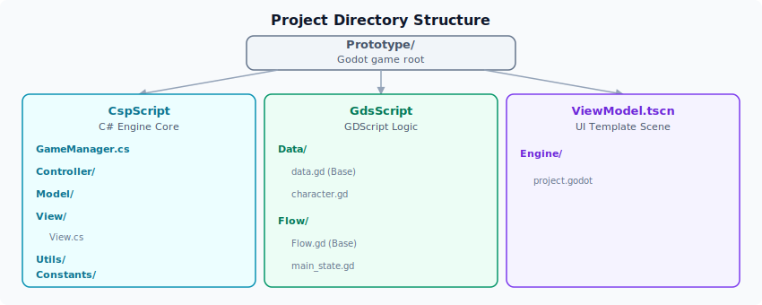

# 环境搭建

本教程将带你完成 ERA-Engine 开发环境的搭建。完成这些步骤后，你将能够在本地运行 ERA-Engine 项目。

## 第一步：下载并安装 Godot（.NET 版本）

ERA-Engine 基于 Godot 构建，你需要安装 **Godot 的 .NET 版本**（包含 C# 支持）。

> ⚠️ **注意**：请务必下载 **.NET 版本**，而不是标准版。标准版不包含 C# 支持，无法运行 ERA-Engine。

=== "Windows"

    1. 访问 [Godot 官方下载页面](https://godotengine.org/download/)
    2. 找到 **Godot Engine - .NET** 栏目
    3. 下载 Windows 版本（文件名为 `Godot_vX.X-stable_mono_win64.exe`）
    4. 将可执行文件解压到你希望存放的目录（如 `C:\Tools\Godot\`）
    5. 双击 `Godot.exe` 运行

=== "macOS"

    1. 访问 [Godot 官方下载页面](https://godotengine.org/download/)
    2. 找到 **Godot Engine - .NET** 栏目
    3. 下载 macOS 版本（文件名为 `Godot_vX.X-stable_mono_macos.universal.dmg`）
    4. 打开 `.dmg` 文件，将 `Godot.app` 拖入 `Applications` 文件夹

=== "Linux"

    1. 访问 [Godot 官方下载页面](https://godotengine.org/download/)
    2. 找到 **Godot Engine - .NET** 栏目
    3. 下载 Linux 版本（文件名为 `Godot_vX.X-stable_mono_linux.x86_64`）
    4. 解压到希望存放的目录（如 `~/Applications/Godot/`）
    5. 赋予执行权限：`chmod +x Godot_vX.X-stable_mono_linux.x86_64`
    6. 运行：`./Godot_vX.X-stable_mono_linux.x86_64`

运行 Godot，你应该看到项目管理器界面。此时不要创建新项目——我们后续会直接打开 ERA-Engine 项目。

## 第二步：安装 .NET SDK

ERA-Engine 的 C# 核心代码需要 .NET SDK 才能编译。

1. 访问 [.NET 官方下载页面](https://dotnet.microsoft.com/en-us/download/dotnet/)
2. 选择适合你操作系统的最新稳定版 SDK 并下载
3. 运行安装程序，使用默认选项完成安装

安装完成后，打开终端验证安装：

```bash
dotnet --version
```

如果输出版本号，说明安装成功。

## 第三步：获取 ERA-Engine

使用 Git 将 ERA-Engine 项目克隆到本地：

```bash
# 进入你希望存放项目的目录
cd ~/Projects

# 克隆仓库
git clone https://github.com/Zhen-LinHuo/era-engine.git

# 进入项目目录
cd era-engine
```

> 💡 如果你没有安装 Git，可以从 [Git 官网](https://git-scm.com/downloads) 下载安装，或直接下载仓库的 ZIP 压缩包并解压到本地。

项目目录结构概览：



## 第四步：在 Godot 中打开并运行项目

1. 启动 Godot，进入项目管理器
2. 点击右侧的 **导入（Import）** 按钮
3. 浏览到 ERA-Engine 项目目录，选中 `project.godot` 文件
4. 点击 **导入并编辑（Import & Edit）**

Godot 将打开项目。首次打开时可能需要一些时间编译 C# 代码——你可以在底部的状态栏看到编译进度。

编译完成后，点击右上角的 **运行项目（Play）** 按钮（或按 `F5`）。如果一切正常，你应该看到 ERA-Engine 的原型游戏窗口弹出，显示默认的文本和按钮。

> ⚠️ **常见问题**：如果点击运行后报错，请检查：
> - 是否下载了 **.NET 版本**的 Godot（而不是标准版）
> - .NET SDK 是否正确安装（在终端运行 `dotnet --version` 验证）
> - Godot 编辑器设置中，**Editor → Editor Settings → Dotnet → Editor** 下的 external editor 是否指向了正确的 .NET SDK

## 第五步：认识 Prototype 场景

成功运行后，让我们快速了解一下工作区的结构：

### 场景文件

ERA-Engine 的核心场景是 `Prototype` 场景。打开项目后，在左下角的 **FileSystem** 面板中可以看到：

| 路径 | 说明 |
|:-----|:-----|
| `Prototype/GdsScript/Flow/main_state.gd` | 主入口状态文件，游戏的起点 |
| `Prototype/GdsScript/Flow/` | 所有状态函数（游戏逻辑）的存放目录 |
| `Prototype/Data/` | 数据文件的存放目录 |

### 工作流程

在 ERA-Engine 中开发游戏，你主要做两件事：

1. **编写状态函数**：在 `Flow/` 目录下创建 `.gd` 文件，编写 `TXT()`、`BTN()`、`BOX()` 等函数来定义每个游戏状态的显示内容和交互
2. **准备数据文件**：在 `Data/` 目录下放置数据文件（如 CSV），引擎会自动加载并暴露给状态函数使用

---

环境搭建完成！接下来，让我们进入 [显示文本](display-text.md)，写出你的第一行 ERA-Engine 代码。
